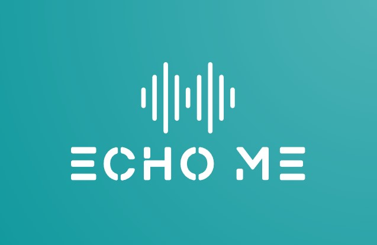

# Echo-Me

A **South African Sign Language Interpreter** desktop application developed with Python. This AI-powered application uses computer vision and deep learning to translate sign language gestures into speech in real-time.



## 🌟 Features

- **Real-time Sign Language Recognition** - Uses MediaPipe and TensorFlow for accurate gesture detection
- **Text-to-Speech Conversion** - Converts recognized signs to spoken words with multiple voice options
- **Speech-to-Text** - Voice recognition with microphone input device selection
- **Multi-language Translation** - Translate text before speech synthesis
- **Modern GUI** - Clean, responsive interface built with PySide6
- **User Preferences** - Customizable themes, voice settings, and user accounts
- **Live TTS Toggle** - Enable/disable instant speech output for detected signs
- **Audio Export** - Download generated speech as audio files

## 🎯 Supported Signs

The application recognizes various South African Sign Language gestures including:

**Letters**: a, b, c, d, e, f, g, h, i, k
**Words**: you, me, my, hello, like, apple, orange, pear, name, j, z
**Special**: None (no gesture detected)

## 🛠️ Technology Stack

- **Computer Vision**: MediaPipe, OpenCV
- **Machine Learning**: TensorFlow, Keras, NumPy
- **GUI Framework**: PySide6 (Qt)
- **Speech Processing**: SpeechRecognition, PyAudio, gTTS, pyttsx3
- **Translation**: deep-translator
- **Audio**: pygame
- **Security**: bcrypt, cryptography

## 📋 Requirements

Before installation, ensure you have:

- **Python 3.11**
- **pip** (Python package manager)
- **Git** (optional, for version control)
- **CUDA 11.8+** (optional, for GPU acceleration)
- **Webcam** (for sign language detection)
- **Microphone** (for speech-to-text functionality)

## 🚀 Quick Start

### 1. Clone the Repository

```bash
git clone https://github.com/Quinny-dev/Echo-Me.git
cd Echo-Me
```

### 2. See SETUP_GUIDE.md

[GOT TO SETUP GUIDE](setup/SETUP_GUIDE.md)

## 📁 Project Structure

```
Echo-Me/
├── assets/                     # Application icons and images
├── data/                       # Training data (sign language samples)
│   ├── None/                   # No gesture samples
│   ├── holds_data/             # Letter signs (a-k)
│   └── nonholds_data/          # Word signs and special gestures
├── models/                     # Trained AI models
│   ├── model_fast/            # Main recognition model
│   └── archived/              # Previous model versions
├── scripts/                    # Application source code
│   ├── gui.py                 # Main GUI application
│   ├── launcher.py            # Splash screen launcher
│   ├── login.py               # User authentication
│   ├── camera_handler.py      # Camera and video processing
│   ├── model_handler.py       # AI model management
│   ├── tts_handler.py         # Text-to-speech processing
│   ├── stt_handler.py         # Speech-to-text processing
│   ├── styling.py             # UI themes and styling
│   ├── custom_popups.py       # Modern dialog boxes
│   ├── preferences_dialog.py  # User settings interface
│   ├── user_data.py           # User data management
│   └── hand_landmarking/      # MediaPipe hand detection
├── setup/                      # Installation and setup files
│   ├── setup_venv.bat         # Windows setup script
│   ├── setup_venv.sh          # macOS/Linux setup script
│   └── venv/                  # Virtual environment (created after setup)
├── check_*.py                  # Diagnostic and testing scripts
├── client.py                   # Optional client for distributed setup
├── server.py                   # Optional server for distributed setup
└── requirements.txt            # Python dependencies
```

## 🎮 How to Use

### First Launch
1. **Create Account**: Sign up with a username and password
2. **Login**: Use your credentials to access the application

### Main Interface
- **Camera View**: Shows live video feed with hand detection
- **Text-to-Speech Tab**: Displays recognized signs and converts to speech
- **Speech-to-Text Tab**: Voice recognition and transcription
- **Live TTS Toggle**: Enable/disable instant speech for detected signs

### Settings & Preferences
- **Theme**: Toggle between dark and light modes
- **Voice Settings**: Choose language, voice type, and speed
- **Translation**: Select target language for text translation
- **Microphone**: Select input device for speech recognition

## 🔧 Advanced Configuration

### Custom Models
Replace `models/model_fast/` with your own trained model:
1. Ensure the model expects the same input format (MediaPipe landmarks)
2. Update label mappings if using different gesture classes
3. Run diagnostic scripts to verify compatibility:
   ```bash
   python check_model_shape.py
   python check_labels.py
   ```

## 🐛 Troubleshooting

### Installation Issues
If setup fails or dependencies conflict:

1. **Check Python Version**:
   ```bash
   python --version
   ```
   Ensure you're using Python 3.11

2. **Remove Old Environment**:
   ```bash
   # Windows
   rmdir /s /q setup\venv
   
   # macOS/Linux
   rm -rf setup/venv
   ```

3. **Re-run Setup**:
   Follow the installation steps again

### Camera Issues
- **No Camera Detected**: Check camera permissions and ensure no other apps are using it
- **Poor Detection**: Ensure good lighting and clear background
- **Slow Performance**: Try reducing camera resolution or enabling GPU acceleration

### Audio Issues
- **No Speech Output**: Check system audio settings and ensure speakers are working
- **Microphone Not Working**: Use "Select Input Device" to choose the correct microphone
- **Poor Recognition**: Speak clearly and check microphone levels

### Model Issues
- **Wrong Predictions**: Ensure model and label order match using diagnostic scripts
- **Model Load Error**: Verify model files are intact and compatible with TensorFlow version

## 🤝 Contributing

We welcome contributions! Here's how to get started:

1. **Fork the Repository**
2. **Create Feature Branch**: `git checkout -b feature/amazing-feature`
3. **Make Changes**: Implement your feature or bug fix
4. **Add Tests**: Ensure your changes work correctly
5. **Commit Changes**: `git commit -m 'Add amazing feature'`
6. **Push Branch**: `git push origin feature/amazing-feature`
7. **Create Pull Request**: Submit your changes for review

### Development Guidelines
- Follow PEP 8 style guidelines
- Add comments and docstrings to new functions
- Test your changes thoroughly
- Update documentation if needed

## 📊 Model Training

To train custom models:

1. **Prepare Data**: Organize sign language samples in `data/` folders
2. **Extract Features**: Use MediaPipe to convert videos to landmark data
3. **Train Model**: Use TensorFlow/Keras with LSTM architecture
4. **Evaluate**: Test model accuracy and performance
5. **Deploy**: Replace model files and update labels

Example training data structure:
```
data/
├── holds_data/          # Single letters
│   ├── a/              # Letter 'a' samples
│   ├── b/              # Letter 'b' samples
│   └── ...
└── nonholds_data/      # Words and phrases
    ├── hello/          # 'Hello' gesture samples
    ├── thank_you/      # 'Thank you' gesture samples
    └── ...
```

## 📄 License

This project is licensed under the MIT License - see the [LICENSE](LICENSE) file for details.

## 🙏 Acknowledgments

- **MediaPipe** - Google's framework for building perception pipelines
- **TensorFlow** - Open-source machine learning platform
- **PySide6** - Python bindings for Qt application framework

**Happy signing and coding!**  
— Echo-Me Development Team

*A Third Year BComp Project developing inclusive technology for the deaf and hard-of-hearing community.*